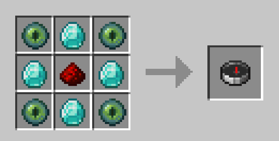

# Vision Focus Compass

## Description

A simple datapack that adds a gadget to the game that allows the player to see entities through walls.

## Instalation

Move the "vision_focus_dp.zip" to your world datapack folder and open your minecraft world

## Crafting Recipe

## Usage

- Right click while the compass is in your hand
- It will give the nearby entities (in a 32 block radius) the glowing effect
- While using the compass, you will be given a slowness effect
- It has a delay of 70 second after every usage
